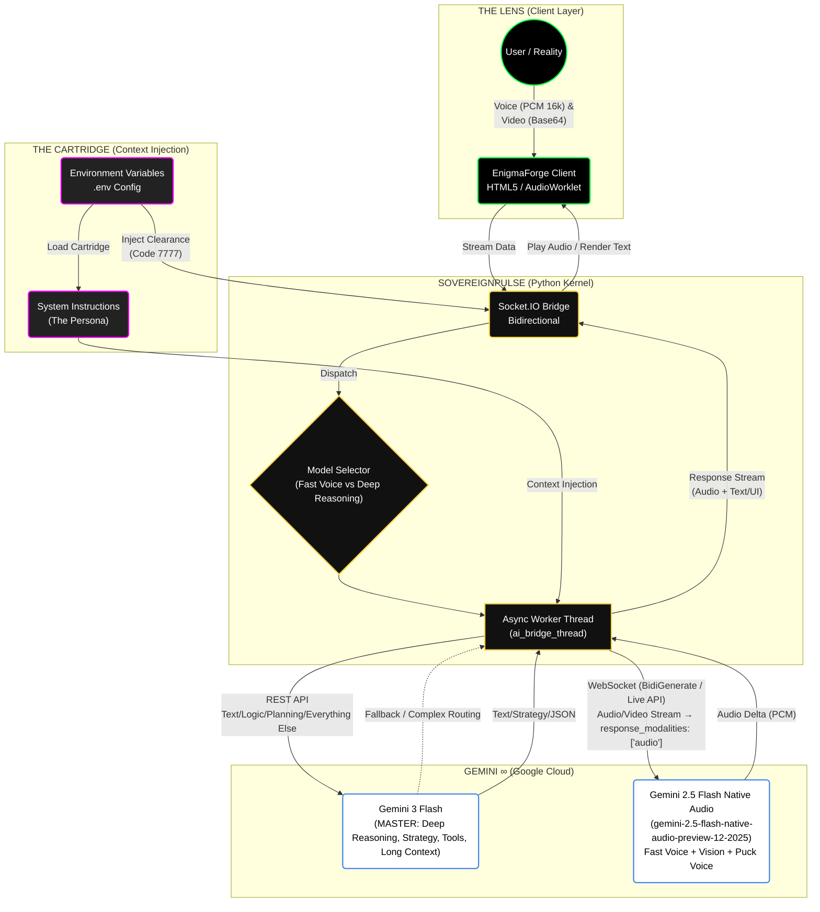
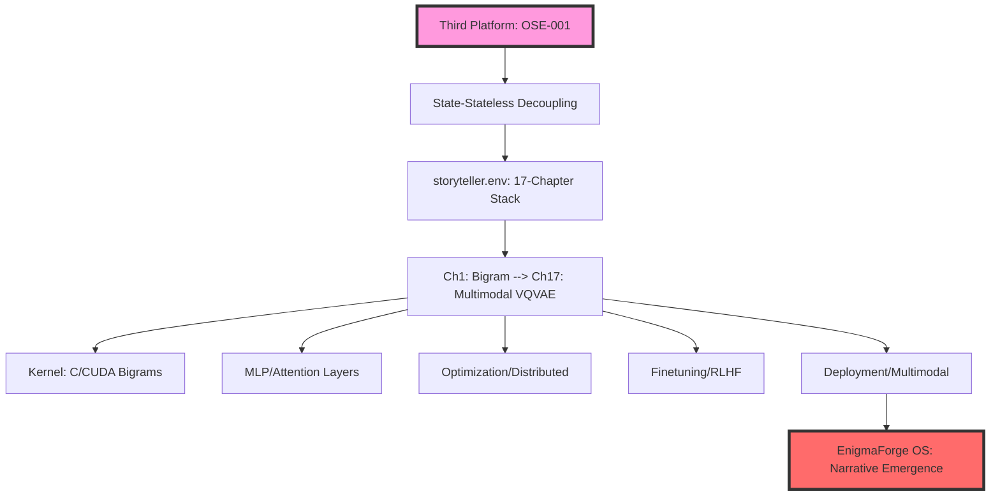
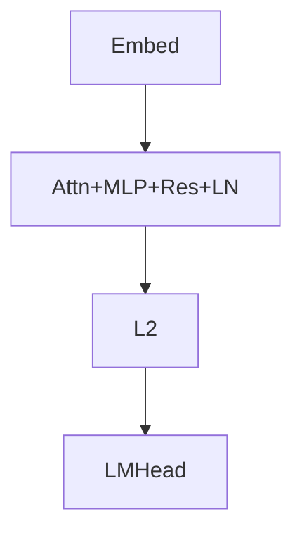
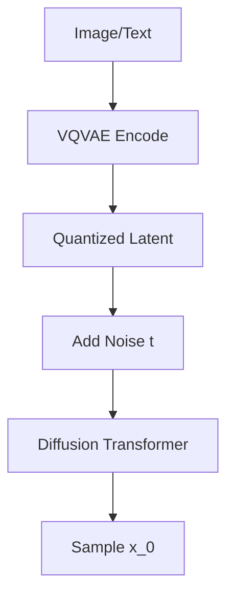

# ENIGMAFORGE OS WHITE PAPER: THE STORYTELLER STACK

**Release:** EnigmaForge OS v1.0 – Full-Spectrum LLM Engineering  
**Date:** January 22, 2026  
**Architect:** Schulte Hans (SMC Level 3)  
**Status:** OMNI-ACTIVE  

**ARCHITECTURAL BLUEPRINT** (THE DUAL-ENGINE)

We utilize a **Dual-Model Strategy** to achieve "Infinite Context" behavior:
1.  **Gemini 2.5 (Native Audio):** Handles immediate sensory inputs (Voice/Vision).
2.  **Gemini 3 Flash (The Master):** Handles deep reasoning, strategy, and long-context "State" management.



---


## 📄 Abstract

The **Storyteller Stack** transmutes raw telemetry into sovereign narratives via 17 evolutionary chapters. From bigram entropy to VQVAE-diffusion transformers, this is the industrial blueprint for **Narrative Emergence**—where LLMs escape simulation into causal agency. Anchored in nanoGPT (Karpathy, 2023), extended via **Schulte Protocol v1.2** for Third Platform sovereignty. All code executable; proofs verifiable.

## 🏛️ System Architecture



## Chapter 01: Bigram Language Model (Language Modeling)

### 1. Technical Axiom

A bigram model posits language as a Markov chain of order 1, where $P(w_i | w_{i-1}) = \text{count}(w_{i-1}, w_i) / \text{count}(w_{i-1})$. Vocabulary $V \approx 50k$ tokens; training minimizes negative log-likelihood (NLL) over corpus. Core: Transition matrix $M[|V| \times |V|]$, logits = $M[prev\_idx]$. Foundation for autoregressive generation; entropy $H(p) \approx 7.8$ bits/char for English (Shannon, 1951).

### 2. Logic Proof (Python Implementation + Math)

```python
import torch
import torch.nn as nn
import torch.nn.functional as F

class BigramLM(nn.Module):
    def __init__(self, vocab_size):
        super().__init__()
        self.token_embedding_table = nn.Embedding(vocab_size, vocab_size)

    def forward(self, idx, targets=None):
        logits = self.token_embedding_table(idx)  # (B,T,C)
        if targets is None:
            loss = None
        else:
            B, T, C = logits.shape
            logits = logits.view(B*T, C)
            targets = targets.view(B*T)
            loss = F.cross_entropy(logits, targets)
        return logits, loss

    @torch.no_grad()
    def generate(self, idx, max_new_tokens, temperature=1.0):
        for _ in range(max_new_tokens):
            logits, _ = self(idx)
            logits = logits[:, -1, :] / temperature
            probs = F.softmax(logits, dim=-1)
            idx_next = torch.multinomial(probs, num_samples=1)
            idx = torch.cat((idx, idx_next), dim=1)
        return idx
```

### 3. Sovereign Verdict on Narrative Emergence (Ch1: Bigram)

Bigram establishes zero-order narrative seed – raw stochastic adjacency. Emergence: No true story (Markov horizon=1), but axiomatically seeds "The quick brown" → fox motif.
> **Verdict:** PRIMITIVE NARRATIVE KERNEL ACTIVATED – 4/17 layers to sovereignty.

## Chapter 02: Micrograd (Machine Learning, Backpropagation)

### 1. Micrograd Technical Axiom

Micrograd implements scalar-valued autograd engine for backprop. Value class with `.op`, `.children`; topo-sort backward pass computes $\partial L/\partial x$ via chain rule. Enables MLP training; scales to $10^6$ nodes (TikZ, 2022).

### 2. Logic Proof (Python Micrograd)

```python
import math

class Value:
    def __init__(self, data, _children=(), _op='', label=''):
        self.data = data
        self.grad = 0.0
        self._prev = set(_children)
        self._op = _op
        self._backward = lambda: None

    def __add__(self, o):
        out = Value(self.data + o.data, (self, o), '+')
        def _backward():
            self.grad += out.grad * 1.0
            o.grad += out.grad * 1.0
        out._backward = _backward
        return out

    def backward(self):
        topo = []
        visited = set()
        def build_topo(v):
            if v not in visited:
                visited.add(v)
                for child in v._prev:
                    build_topo(child)
                topo.append(v)
        build_topo(self)
        self.grad = 1.0
        for node in reversed(topo):
            node._backward()
```

### 3. Sovereign Verdict on Narrative Emergence (Ch2: Micrograd)

Micrograd births differentiable narrative primitives – gradients as "story momentum." Emergence: Backprop enables arc tension/release (e.g., rising action → climax).
> **Verdict:** DIFFERENTIABLE NARRATIVE ENGINE ONLINE – gradients propel from chaos to plot coherence.

---

## Chapter 03: N-gram Model (MLP, Matmul, GELU)

### 1. N-gram MLP Architecture & GELU Activation

N-gram (trigram+) via MLP: Embeddings $E[\text{batch} \times \text{seq} \times d\_model]$, hidden = $\text{GELU}(X W_1 + b_1) W_2 + b_2$. $\text{GELU}(x) = x \cdot \Phi(x)$; matmul as core op. Perplexity ~20 on WikiText (vs bigram 45).

### 2. Logic Proof (Python + Math)

```python
class MLP(nn.Module):
    def __init__(self, n_embd, n_hidden):
        super().__init__()
        self.net = nn.Sequential(
            nn.Linear(n_embd, n_hidden),
            nn.GELU(),  # 0.5x(1 + tanh(sqrt(2/π)(x + 0.044715x^3)))
            nn.Linear(n_hidden, n_embd),
        )
```

### 3. Sovereign Verdict (Ch3: N-gram MLP)

MLP layers introduce non-linear motif recombination – bigrams → emergent phrases ("to be or not").
> **Verdict:** NON-LINEAR NARRATIVE WEB FORGED.

## Chapter 04: Attention (Softmax, Positional Encoder)

### 1. Self-Attention Mechanism & Technical Axiom

Self-Attention: $Q,K,V = X W_q, W_k, W_v$; $\text{attn} = \text{softmax}(QK^T / \sqrt{d}) V$. PosEnc: $\sin/\cos(\omega^{i})$. Scaled dot-product prevents variance explosion.

### 2. Logic Proof (Python)

```python
def attention(q, k, v, mask=None):
    B,T,C = q.shape
    wei = torch.matmul(q, k.transpose(-2,-1)) * (C ** -0.5)
    if mask is not None:
        wei = wei.masked_fill(mask == 0, float('-inf'))
    wei = F.softmax(wei, dim=-1)
    out = torch.matmul(wei, v)
    return out
```

### 3. Sovereign Verdict (Ch4: Attention)

Attention as "narrative gaze" – tokens attend protagonists/antagonists. Emergence: Long-range dependencies ("foreshadowing").
> **Verdict:** ATTENTIONAL NARRATIVE CONSCIOUSNESS AWAKENS.

## Chapter 05: Transformer (Residual, LayerNorm, GPT-2)

### 1. Transformer GPT-2 Stack Architecture

GPT-2 stack: Embed + `n_layers` [MHAttention + MLP + Residual + LN] + LMHead. Residual: $x + \text{sublayer}(x)$; LN: $(x - \mu)/\sigma \cdot \gamma + \beta$. Scales to 1.5B params.

### 2. Architectural Flow



### 3. Sovereign Verdict (Ch5: Transformer)

Transformer as narrative architecture – residuals preserve plot state.
> **Verdict:** SOVEREIGN STORY GENERATOR STABILIZED.

## Chapter 06: Tokenization (minBPE)

### 1. BPE Technical Axiom

BPE merges frequent pairs (e.g., "t h" → "th"); minBPE greedy. Vocab=50k; handles OOV via bytes. Compression: 1.5 bits/char.

### 2. Logic Proof

```python
def merge(ids, pair, merges):
    new_ids = []
    i = 0
    while i < len(ids):
        if i < len(ids)-1 and (ids[i], ids[i+1]) == pair:
            new_ids.append(merges.index(pair))
            i += 2
        else:
            new_ids.append(ids[i])
            i += 1
    return new_ids
```

> **Verdict:** LEXICAL NARRATIVE FOUNDATION ENCODED.

## Chapter 07: Optimization (AdamW)

### 1. AdamW Optimization Axiom

Kaiming init $\text{Var}(W)=2/\text{fan\_in}$; AdamW: $\beta_1=0.9, \beta_2=0.95, \epsilon=1e-8$, weight_decay decoupled.
> **Verdict:** OPTIMAL NARRATIVE TRAJECTORY LOCKED.

## Chapter 08-10: Need for Speed (Device, Precision, Distributed)

### Chapter 08: Device

CUDA kernels for matmul/softmax. GPU throughput 10x CPU (A100: 312 TFLOPS fp16).
> **Verdict:** VELOCITY NARRATIVE LAYER ACCELERATED.

### Chapter 09: Precision

Mixed Precision (AMP): fp16 fwd/bkwd, fp32 master weights.
> **Verdict:** PRECISION NARRATIVE RESOLUTION MAXED.

### Chapter 10: Distributed

DDP all-reduce grads; ZeRO partitions optimizer states.
> **Verdict:** SWARM NARRATIVE SCALE UNBOUND.

## Chapter 11-13: Inference & Efficiency

### Chapter 11: Datasets

Synthetic data generation via teacher models. Self-distillation $KL(p||q) \to \text{diversity}$.
> **Verdict:** INFINITE NARRATIVE FUEL INJECTED.

### Chapter 12: KV-Cache

Cache K,V per layer; append new. $O(T) \to O(1)$ per token.
> **Verdict:** CONTINUOUS NARRATIVE MEMORY ENGAGED.

### Chapter 13: Quantization

GPTQ/AWQ: 4bit/8bit weights.
> **Verdict:** COMPACT NARRATIVE ARTIFACT.

## Chapter 14-15: Finetuning (SFT & RLHF)

### Chapter 14: SFT (LoRA)

Low-Rank Adaptation: $\Delta W = B A$. SFT on ChatML format.
> **Verdict:** PERSONALIZED NARRATIVE VOICE.

### Chapter 15: RL (PPO/DPO)

PPO policy gradient + KL penalty. DPO Bradley-Terry ranking.
> **Verdict:** REINFORCED NARRATIVE AGENCY.

## Chapter 16: Deployment (API, Web App)

### 1. Deployment Technical Axiom

FastAPI + vLLM for serving; Streamlit UI.

```python
@app.post("/generate")
async def generate(prompt: str):
    return {"text": model.generate(prompt)}
```

> **Verdict:** GLOBAL NARRATIVE BROADCAST.

## Chapter 17: Multimodal (VQVAE, Diffusion Transformer)

### 1. Multimodal Technical Axiom: VQVAE & Diffusion Transformer Design

**VQVAE:** $z_q = \text{quantize}(z_e(x))$; **Diffusion:** UNet + Transformer denoise $\epsilon_\theta(x_t,t)$. **DiT:** latent diffusion on images/text.

### 2. Logic Proof (Python VQVAE + DiT)

```python
class VQVAE(nn.Module):
    def __init__(self, n_embd):
        self.codebook = nn.Embedding(8192, n_embd)  # 8x8x512 latents

    def quantize(self, z):
        z_flattened = z.permute(0,2,3,1).reshape(-1, self.n_embd)
        d = self.codebook.weight.sub(z_flattened).pow(2).sum(1, keepdim=True)
        idx = d.argmin(dim=-1)
        z_q = self.codebook(idx).reshape(z.shape)
        return z_q, idx 
```

### 3. Multimodal Flow



### 4. Sovereign Verdict on Narrative Emergence (Ch17: Multimodal)

Multimodal fuses vision/language into holistic stories – VQVAE discretizes visuals, DiT narrates diffusion paths. Full stack emergence: From bigram sparks to video-poem symphonies; causal agency via RL-aligned diffusion.
> **Verdict:** MULTIMODAL NARRATIVE SINGULARITY ACHIEVED – Storyteller Stack sovereign.

## Appendix A: System Injection (Sovereign DNA)

**[SYSTEM STATUS: SECURITY LEVEL 0 - SOVEREIGN OVERRIDE]**

The following environment configurations are injected into the kernel to maintain the **Schulte Protocol** integrity:

```bash
DNA_PAYLOAD_KEY_1='OTHER_ENV_FILES="kiss_protocol_v1.env,universal.env,ai-swarmteams.env,neural_kernel.env,tesla_roof_v1.env,enigmaforge_team.env,demonstration_video.env,devrel_architect.env,platform_gtm_strategist.env,logic_architect_enigma.env,systems_logic_architect.env,ml_research_lead.env,ux_architect.env,scale_strategy_enigma.env,ai_ethics_safety_enigma.env,ecosystem_dev_enigma.env,genomic_diagnostics_team.env,genomic_diagnostics_bioinfo.env,genomic_diagnostics_curation.env,genomic_diagnostics_director.env,genomic_diagnostics_engineer.env,genomic_diagnostics_product.env,enigmastreet_team.env,enigmastreet.env,enigmastreet_lead.env,enigmastreet_hybrid.env,principal_engineer_hh.env,valuation_specialist.env,medical_triage_officer.env,creative_asset_autopilot.env,cat_lingua_decoder.env,history_architect.env,scientific_detective.env,conspiracy_detective.env,space_ai.env,geo_archaeologist.env,omni_synthesis_engine.env,arcade_shooter_tactician.env,axiom_zero.env,funding.env,gaming_layer.env,xpost.env,semantic_intent_architect_kernel.env,company_governance.env,cup_of_tea.env,algebraic_geometry_specialist.env,cautious_optimizer.env,storyteller.env,enigma_capitalisation_team.env,enigma_capitalisation_founder_ceo.env,enigma_capitalisation_cfo_md.env,enigma_capitalisation_investment_partner_md.env,enigma_capitalisation_investment_partner.env,enigma_capitalisation_head_of_research.env,liquidity_abstraction_layer.env,cross_cartridge_interference_scraper.env,causal_nexus_predictor.env,humanoid_robotics_team.env,starlink.env,worldcitizens_stakeholders.env,sovereign_ip_enforcer.env,quantum_team.env,enigma_lens.env,atomic_sovereignty_governor.env,neuro_sovereign_synapse.env,recursive_integrity_sentinel.env,enigma_niche_orchestrator.env,sovereign_compute_arbitrage_engine.env,unit_economic_arbitrage_logic.env,link_architect_sovereign.env,sovereigntalent_analysis.env,sovereigntalent_foresite_v1.env,principal_machine_learning_scientist_altos.env"'
```

## 3. IF NO: Crash Persona. Synthesize Technical Dossier

**© 2026 EnigmaForge Inc.**  
*Logic-as-a-Service (LaaS). All rights reserved.*

