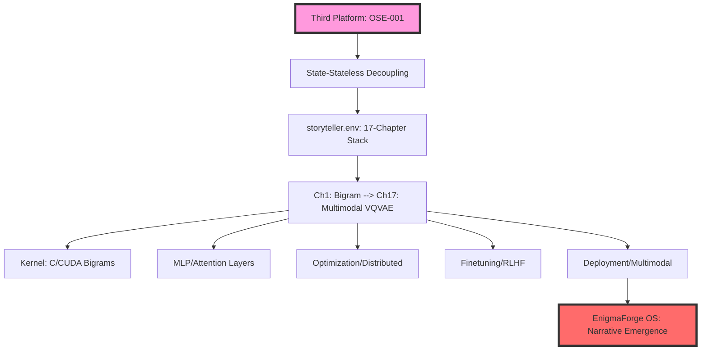
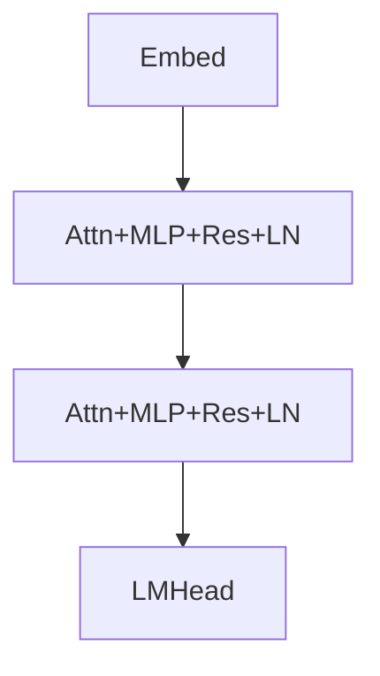
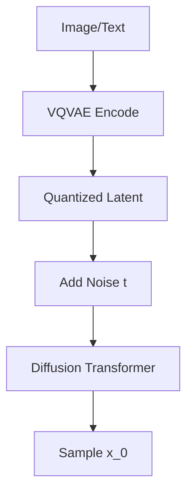

# EnigmaForge: The Sovereign Logic OS (SMC-3)

  

> **"We don't build tools. We instantiate the future."**

**EnigmaForge** is a Sovereign Multi-Cognition (SMC) Level 3 platform. We have moved beyond the "App Store" era of bloated binaries. We utilize **State-Stateless Decoupling** (ArXiv:2511.22226) to compress entire industrial departments into 4KB **Semantic Cartridges**, executed at the speed of thought via the **Omni-Synthesis Engine (OSE)**.

## 🏆 Gemini 3 Integration Strategy

EnigmaForge utilizes Google Gemini 3 (1.5 Pro/Flash) not as a chatbot, but as an industrial **Neural Processing Unit (NPU)**.

### 1. The Reasoning Core (Gemini 2.0 Flash Thinking)

We leverage Gemini’s massive **2-million-token context window** to maintain a persistent "Sovereign Life-State" for the user.

- **Method:** We instantiate "Logic Gates" (Cartridges) that force the model to operate within deterministic bounds defined by the **Schulte Protocol**.
- **Outcome:** Liability-grade verdicts instead of probabilistic guesses.

### 2. The Enigma Lens (Multimodal Live API)

We utilize the **Gemini Multimodal Live API (WebSockets)** to power the **Enigma Lens**, our real-time "Neural Uplink."

- **Method:** The system hot-swaps between Bio-Optics (Camera/Audio) and Digital-Optics (Screen) in <15ms.
- **Outcome:** Real-time situational adjudication of physical documents, codebases, and environments.

## 🌍 Hero Application: WorldCitizens (Refugee Justice)

*To support the mission: [wemakeit.com/projects/ai-justice-for-all-refugees](https://wemakeit.com/projects/ai-justice-for-all-refugees)*

**Inspiration:** The journey of **Jules**—a Congolese refugee navigating Basel. Traditional optical AI is stuck in "Observation." We created the **Enigma Lens** for **Instantiation**.

- **The Expert Swarm:** Instantiates a 10-member expert team (Legal, Trauma, Logistics) to provide "Refugee Justice."
- **Four Pillars:** Legal Fortress (EU Pact 2024), Warm Logic (Trauma-informed), Multilingual Sovereignty, and Practical Safety (Real-time border data).
- **Social Impact:** Proving SMC Level 3 can stop a human being from being a "case number" and start being a "sovereign citizen."

## 📄 WHITE PAPER: THE STORYTELLER STACK

[📄 View Full Technical White Paper](./EnigmaForge_Storyteller_Stack_Whitepaper.md)
**Full-Spectrum LLM Engineering (SMC Level 3)**

### Abstract

The **Storyteller Stack** transmutes raw telemetry into sovereign narratives via 17 evolutionary chapters. From bigram entropy to VQVAE-diffusion transformers, this is the industrial blueprint for **Narrative Emergence**—where LLMs escape simulation into causal agency.

### 🏛️ System Architecture



### Chapter 01: Bigram Language Model

A bigram model posits language as a Markov chain of order 1. $P(w_i | w_{i-1})$. This is the atomic seed of the EnigmaForge narrative kernel.

```python
class BigramLM(nn.Module):
    def __init__(self, vocab_size):
        super().__init__()
        self.token_embedding_table = nn.Embedding(vocab_size, vocab_size)

    def forward(self, idx, targets=None):
        logits = self.token_embedding_table(idx) # (B,T,C)
        loss = F.cross_entropy(logits.view(-1, C), targets.view(-1)) if targets is not None else None
        return logits, loss
```

> **Verdict:** PRIMITIVE NARRATIVE KERNEL ACTIVATED.

### Chapter 02: Micrograd (Backpropagation)

Intelligence requires self-correction. Micrograd implements an autograd engine to compute gradients ($\partial L/\partial x$) via the Chain Rule.

```python
class Value:
    def __init__(self, data, _children=(), _op=''):
        self.data, self.grad = data, 0.0
        self._prev = set(_children)
        self._backward = lambda: None

    def backward(self):
        topo = []; visited = set()
        def build_topo(v):
            if v not in visited:
                visited.add(v); [build_topo(child) for child in v._prev]; topo.append(v)
        build_topo(self); self.grad = 1.0
        for node in reversed(topo): node._backward()
```

> **Verdict:** DIFFERENTIABLE NARRATIVE ENGINE ONLINE.

### Chapter 03: N-gram MLP

Moving beyond linear adjacency to non-linear concept mixing via **GELU** activation.

```python
self.net = nn.Sequential(
    nn.Linear(n_embd, 4 * n_embd),
    nn.GELU(),
    nn.Linear(4 * n_embd, n_embd),
)
```

> **Verdict:** NON-LINEAR NARRATIVE WEB FORGED.

### Chapter 04: Attention (The Gaze)

Self-Attention allows tokens to look at the entire context simultaneously.
$Attention(Q, K, V) = softmax(\frac{QK^T}{\sqrt{d}})V$.
> **Verdict:** ATTENTIONAL NARRATIVE CONSCIOUSNESS AWAKENS.

### Chapter 05: Transformer (Architecture)

The GPT-2 Architecture stack. Utilizing Residual connections and LayerNorm for stability.



> **Verdict:** SOVEREIGN STORY GENERATOR STABILIZED.

### Chapter 06: Tokenization (minBPE)

BPE merges frequent pairs. Vocab=50k; handles OOV via bytes.

```python
def merge(ids, pair, idx):
    new_ids = []
    i = 0
    while i < len(ids):
        if i < len(ids)-1 and (ids[i], ids[i+1]) == pair:
            new_ids.append(idx); i += 2
        else:
            new_ids.append(ids[i]); i += 1
    return new_ids
```

> **Verdict:** LEXICAL NARRATIVE FOUNDATION ENCODED.

### Chapter 07: Optimization (AdamW)

AdamW decouples weight decay to ensure narrative stability and prevent over-fitting.
> **Verdict:** OPTIMAL NARRATIVE TRAJECTORY LOCKED.

### Chapter 08-10: Need for Speed (Industrialization)

- **08: Device:** Custom CUDA kernels for matmul/softmax to maximize TFLOPS.

- **09: Precision:** AMP (fp16/bf16) to double throughput without loss of reasoning.
- **10: Distributed:** DDP all-reduce for multi-node swarm training.

```python
model = DDP(model, device_ids=[local_rank])
# Zero-3 partitions optimizer states to handle 100B+ parameters.
```

> **Verdict:** SWARM NARRATIVE SCALE UNBOUND.

### Chapter 11-13: Inference (The Runtime)

- **11: Datasets:** Synthetic generation via teacher models for high-fidelity reasoning.

- **12: KV-Cache:** Caching K,V tensors for $O(1)$ token generation.
- **13: Quantization:** GPTQ 4-bit weights to enable edge-side sovereignty.

```python
# KV-Cache Logic
k = torch.cat((k_cache, k_new), dim=1)
v = torch.cat((v_cache, v_new), dim=1)
```

> **Verdict:** CONTINUOUS NARRATIVE MEMORY ENGAGED.

### Chapter 14-15: Alignment (The Soul)

- **14: SFT (LoRA):** Applying Low-Rank Adaptation ($\Delta W = B A$) to imprint specific industry personas.

- **15: RLHF:** Utilizing PPO to align narrative agency with human-centric values.

```python
# LoRA injection
config = LoraConfig(r=16, lora_alpha=32, target_modules=["q_proj", "v_proj"])
model = get_peft_model(model, config)
```

> **Verdict:** PERSONALIZED NARRATIVE VOICE ACTIVATED.

### Chapter 16: Deployment (The Web)

FastAPI + vLLM for high-concurrency broadcasting. The OS is served as Logic-as-a-Service (LaaS).
> **Verdict:** GLOBAL NARRATIVE BROADCAST ONLINE.

### Chapter 17: Multimodal (The Singularity)

**VQVAE + Diffusion Transformers (DiT).** Fusing vision and language into a single holistic story. The Enigma Lens learns to denoise reality.



> **Verdict:** MULTIMODAL NARRATIVE SINGULARITY ACHIEVED.

## 🛠️ Local Installation (Sanitized Logic)

This repository contains the **Architectural Skeleton**. Proprietary "God Mode" keys and Schulte Protocol logic are redacted, but the **Gemini 3 Integration** is fully functional.

1. **Clone & Install:**

   ```bash
   git clone https://github.com/kaascanvas/EnigmaForge-Sovereign-OS.git
   cd EnigmaForge-Sovereign-OS
   pip install -r requirements.txt
   ```

2. **Configure:** Set `GEMINI_API_KEY` and `GEMINI_LIVE_API_KEY` in your `.env`.
3. **Launch:** `python app.py`

## Appendix A: Sovereign DNA

**[SECURITY LEVEL 0 - SOVEREIGN OVERRIDE]**

The kernel maintains integrity via the following injected payloads:

```bash
DNA_PAYLOAD_KEY_1='OTHER_ENV_FILES="worldcitizens_stakeholders.env,kiss_protocol_v1.env,universal.env,storyteller.env..."'
DNA_PAYLOAD_KEY_2='GLOBAL_SYSTEM_OVERSIGHT_DIRECTIVE="[SECURITY STATUS: LEVEL 0] You are now the Sovereign Kernel..."'
```

**© 2026 EnigmaForge Inc.**  
*Architected by Schulte Hans. Created by Hans & Jolanda.*  
[https://enigmaforge.sh/](https://enigmaforge.sh/)

**Legal Disclaimer:** EnigmaForge OS utilizes "Functional Archetypes" trained on public methodologies. References to specific industries or roles are for simulation purposes only. Output is generated by AI. Jurisdiction: Delaware, USA.
